# Evaluación Práctica – Primer Parcial
**Estudiante:** Kevin  
**Universidad:** [Universidad Tecnica de Ambato]  
**Carrera:** [Software]  

**Asignatura:** Manejo y Configuración de Software  
**Nombre del Estudiante:** Kevin Velasco
**Fecha:** 08/04/2026

---

# Evaluación Práctica de Git y GitHub

## Instrucciones Generales

- Cada pregunta debe ser respondida directamente en este archivo **(README.md)** debajo del enunciado correspondiente. 
- Es importante que se coloque capturas de pantalla como evidencia de la parte práctica. Se recomienda crear una carpeta `images/` para almacenar las capturas de pantalla.
- Cada respuesta debe ir acompañada de uno o más **commits**, según se indique en cada pregunta.
- Cuando se indique, deberán realizarse acciones prácticas dentro del repositorio (como creación de archivos, ramas, resolución de conflictos, etc.).
- Cada pregunta debe estar **etiquetada con un tag**, únicamente en el commit final correspondiente, con el formato: `"Pregunta 1"`, `"Pregunta 2"`, etc.

---

## Pregunta 1 (1 punto)

**Explicar la diferencia entre los siguientes conceptos/comandos en Git y GitHub:**

- `git clone`  
- `fork`  
- `git pull`

### Parte práctica:

- Realizar un **fork** de este repositorio en la cuenta personal de GitHub del estudiante.
- Luego, realizar un **clone** del fork en el equipo local.
- En este README, describir el proceso seguido:
  - ¿Cómo se realizó el fork?
  - ¿Cómo se realizó el clone del fork?
  - ¿Cómo se verificó que se estaba trabajando sobre el fork y no sobre el repositorio original?
- Realizar en la rama `main` todo lo que corresponde a esta pregunta.

**📝 Respuesta:**

Explicacion:

git clone: Comando de Git que se usa para copiar un repositorio remoto (en GitHub u otro servidor) a tu máquina local. Descarga todo el historial y crea una copia completa para trabajar.

fork: Acción en GitHub que crea una copia del repositorio en tu propia cuenta. Sirve para proponer cambios al proyecto original mediante pull requests o para tener tu propia versión independiente.

git pull: Comando de Git que actualiza tu repositorio local trayendo los cambios más recientes desde el remoto y fusionándolos con tu rama actual.

---

### Evidencias
  
  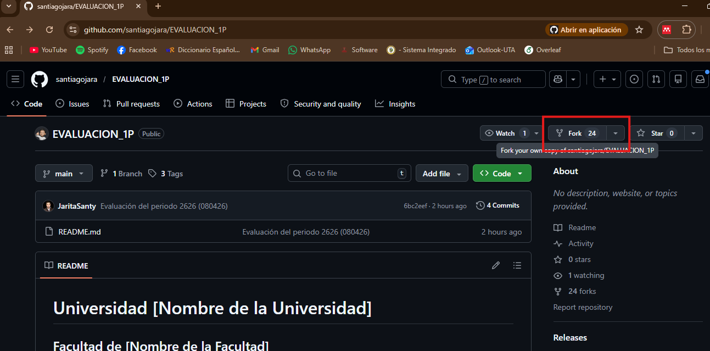
   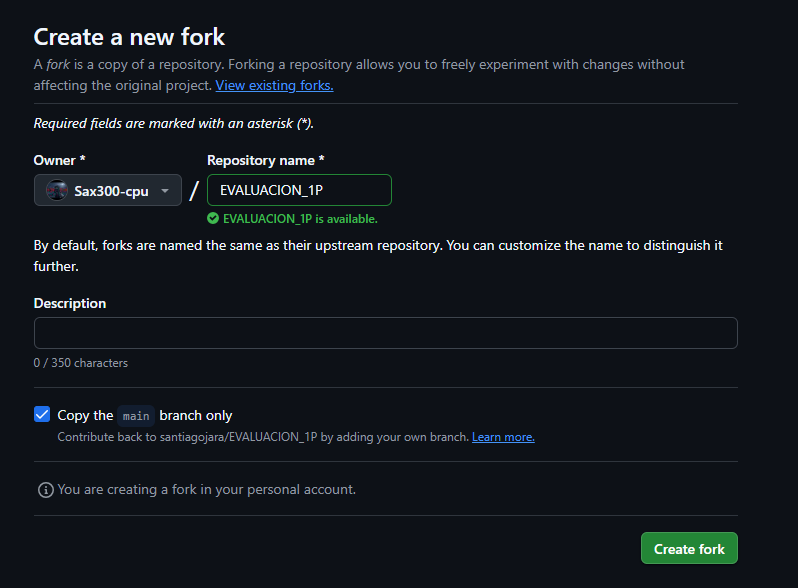
    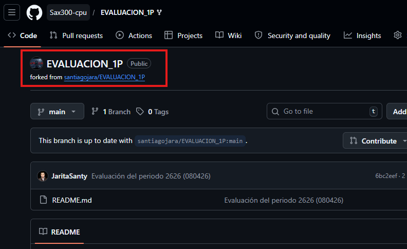
     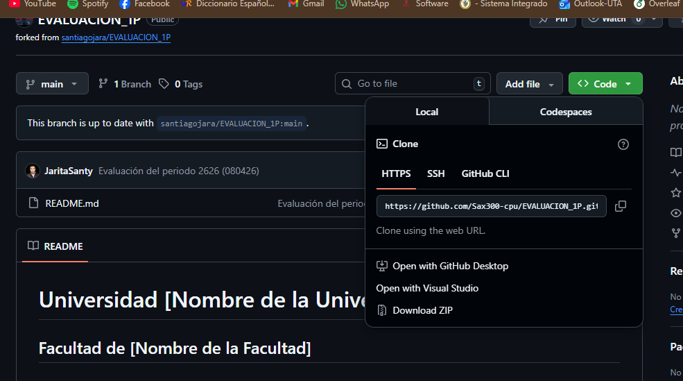
      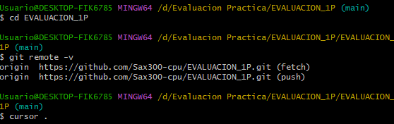

## Pregunta 2 (1 punto)

**Configurar un archivo `.gitignore` para que ignore:**

- Todos los archivos con extensión `.log`.
- Una carpeta llamada `temp/`.
- Todos los archivos `.md` y `.txt`de la carpeta `doc/`. (Probar agregando un archivo `prueba.md` y un archivo `prueba.txt` dentro de la carpeta y fuera de la carpeta.)

### Requisitos:

1. Realizar un **primer commit** que incluya únicamente el archivo `.gitignore` con las reglas de exclusión definidas.
2. Realizar un **segundo commit** que incluya las creación de los archivos de prueba.
2. Realizar un **tercer commit** donde se explique en este README la función del archivo `.gitignore` y se muestre evidencia de que los archivos y carpetas indicadas no están siendo rastreadas por Git.

**Importante:**  
- Solo el **tercer commit** debe llevar el **tag `"Pregunta 2"`**.

**📝 Respuesta:**

El archivo `.gitignore` permite definir qué archivos o carpetas no deben ser rastreados por Git.  
En este caso se configuró para ignorar:
- Archivos `.log`
- Carpeta `temp/`
- Archivos `.md` y `.txt` dentro de la carpeta `doc/`

---EVIDENCIAS
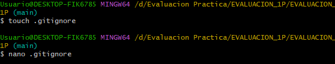
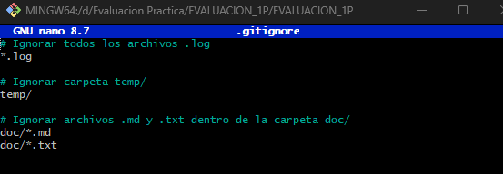
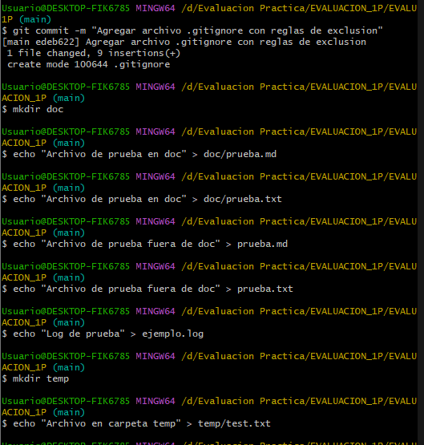
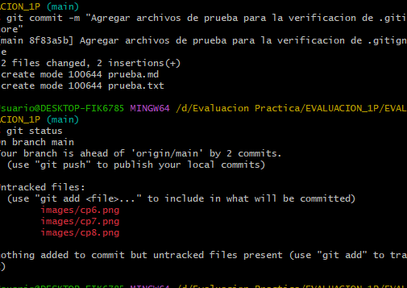

## Pregunta 3 (2 puntos)

**Utilizar Git Flow para desarrollar una nueva funcionalidad llamada `ingresar-encabezado`.**

### Requisitos:

- Inicializar el repositorio con Git Flow, utilizando las ramas por defecto: `main` y `develop`.
- Crear una rama de tipo `feature` con el nombre `ingresar-encabezado`.
- En dicha rama, **completar con los datos personales del estudiante** el encabezado que ya se encuentra al inicio de este archivo `README.md`.
- Realizar al menos un commit durante el desarrollo.
- Finalizar el hotfix siguiendo el flujo de trabajo establecido por Git Flow.

### En la sección de respuesta, se debe incluir:

- Los **comandos exactos** utilizados desde la inicialización de Git Flow hasta el cierre de la rama.
- Una descripción del **proceso seguido**, indicando el propósito de cada paso.
- Una reflexión sobre las **ventajas de aplicar Git Flow**, especialmente en contextos colaborativos o proyectos de larga duración.

**Importante:**

- Deben realizarse varios commits durante esta pregunta.
- **Solo el commit final** debe llevar el **tag `"Pregunta 3"`**.
- El flujo debe respetar la estructura de Git Flow con las ramas `develop` y `main`.

**📝 Respuesta:**

# 1. Inicializar Git Flow en el repositorio
git flow init
# (Aceptar las ramas por defecto: main y develop)

# 2. Crear la rama de tipo feature
git flow feature start ingresar-encabezado

# 3. Editar el README.md y agregar el encabezado con tus datos personales
# (ejemplo: Nombre completo, Universidad, Carrera, etc.)

# 4. Hacer al menos un commit durante el desarrollo
git add README.md
git commit -m "Agregar encabezado con datos personales en README"

# 5. Finalizar la rama feature siguiendo Git Flow
git flow feature finish ingresar-encabezado

# 6. Subir los cambios y tags al remoto
git push origin develop
git push origin main
git push origin --tags

# 7. Crear el tag final para la pregunta
git tag "Pregunta3"
git push origin main --tags

Proceso seguido
Inicialización de Git Flow: Se configuró el repositorio para trabajar con las ramas principales main (producción) y develop (desarrollo).

Creación de la rama feature: Se abrió una rama feature/ingresar-encabezado para desarrollar la nueva funcionalidad sin afectar directamente a develop o main.

Desarrollo: Se editó el archivo README.md para completar el encabezado con los datos personales del estudiante.

Commits intermedios: Se realizaron commits para registrar el progreso del desarrollo.

Finalización de la feature: Con git flow feature finish, la rama se fusionó en develop y se eliminó la rama temporal.

Push al remoto: Se subieron los cambios a GitHub en las ramas correspondientes.

Tag final: Se creó el tag "Pregunta3" en el commit final, cumpliendo con la consigna

Reflexión sobre las ventajas de Git Flow
Organización clara: Git Flow establece un flujo estructurado con ramas específicas para producción (main), desarrollo (develop), nuevas funcionalidades (feature), correcciones rápidas (hotfix) y versiones (release).

Trabajo colaborativo: Facilita que varios desarrolladores trabajen en paralelo sin interferir entre sí, ya que cada funcionalidad se desarrolla en su propia rama.

Control de versiones: Permite mantener un historial ordenado y saber exactamente qué cambios están listos para producción y cuáles aún están en desarrollo.

Reducción de errores: Al separar las ramas, se minimiza el riesgo de introducir errores en la rama principal.

Escalabilidad: Es ideal para proyectos grandes y de larga duración, donde la coordinación y la estabilidad del código son fundamentales.

---
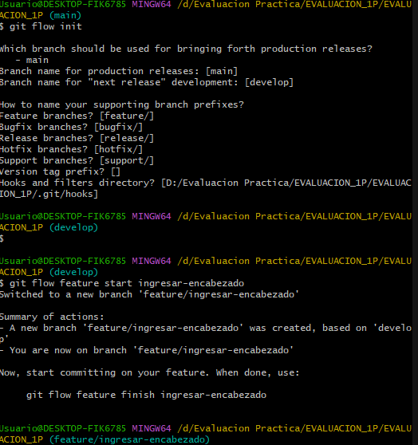

## Pregunta 4 (2 puntos)

**Trabajo con Issues y Pull Requests**

---

### Parte teórica

- **¿Qué es un Pull Request y cuál es su función dentro de un flujo de trabajo colaborativo con Git y GitHub?**  
  Un *Pull Request* (PR) es una solicitud para fusionar cambios desde una rama hacia otra en un repositorio. Su función principal es permitir que otros colaboradores revisen, comenten y aprueben los cambios antes de integrarlos en la rama principal.

- **¿Por qué es importante revisar un Pull Request antes de fusionarlo con la rama principal?**  
  Porque garantiza la calidad del código, evita introducir errores en la rama estable y permite detectar problemas de estilo, seguridad o funcionalidad antes de que lleguen a producción.

- **¿Qué tipo de observaciones o validaciones se suelen realizar durante la revisión de un Pull Request?**  
  - Validación de la lógica y funcionalidad del código.  
  - Revisión de estándares de estilo y buenas prácticas.  
  - Verificación de pruebas unitarias y resultados en CI/CD.  
  - Comentarios sobre documentación o claridad del código.  
  - Confirmación de que no se rompen otras partes del sistema.

---

### Parte práctica

1. Se trabajó en la rama `develop` creada previamente con Git Flow.  
2. Se editó el archivo `README.md` para responder la primera pregunta teórica y se realizó un commit en `develop`.  
3. Se creó un **Pull Request** desde `develop` hacia `main` en GitHub con el nombre:  
   **"Pregunta 4 - Apellido Nombre"**.  
4. En el PR se añadieron comentarios solicitando que se agregue la respuesta de la segunda pregunta.  
   - Se realizó el commit con la respuesta y se actualizó el PR.  
5. Se repitió el procedimiento para la tercera pregunta: comentario → commit → actualización del PR.  
6. Finalmente, se **aprobó el Pull Request** y se realizó el merge hacia `main`.

---

### Evidencias

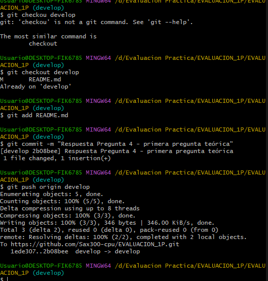
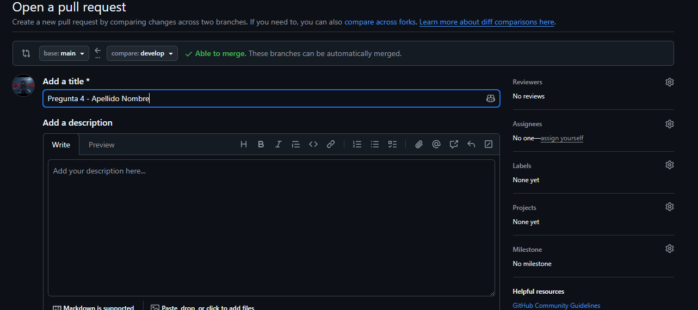
<!-- Escribe aquí tu respuesta completa a la Pregunta 4 -->

---

## Pregunta 5 (2 puntos)

**Resolver conflictos entre ramas y realizar un Pull Request**

### Requisitos:

- Crear dos ramas llamadas `ramaA` y `ramaB`, ambas a partir de la rama `develop`.
- En `ramaA`, crear un archivo llamado `archivoA.txt` con el contenido:  
  `Contenido A`
- En `ramaB`, crear un archivo con el mismo nombre (`archivoA.txt`), pero con el contenido:  
  `Contenido B`
- Intentar fusionar `ramaB` sobre `ramaA`, lo cual debe generar un conflicto.
- Resolver el conflicto combinando ambos contenidos.
- Realizar el merge de `ramaA` hacia `develop`.
- Crear un **pull request** desde `develop` hacia `main`.
- Una vez completado lo anterior, eliminar las ramas `ramaA` y `ramaB`.

### En la sección de respuesta, se debe incluir:

- El procedimiento completo:
  - Cómo se crearon las ramas.
  - Cómo se generó y resolvió el conflicto.
  - Cómo se realizó el merge hacia `develop`.
  - Cómo se eliminaron las ramas al finalizar.
- El enlace al pull request.
- Una breve explicación de qué es un conflicto en Git y por qué ocurrió en este caso.

**📝 Respuesta:**

<!-- Escribe aquí tu respuesta completa a la Pregunta 5 -->

---

## Pregunta 6 (2 puntos)

**Realizar limpieza, explicar versionamiento semántico y enviar cambios al repositorio original**

### Requisitos:

- Trabajar en la rama `develop` del fork del repositorio.
- Eliminar los archivos `archivoA.txt` y `archivoB.txt` creados en preguntas anteriores.
- Realizar un merge desde `develop` hacia `main` en el repositorio local.
- Enviar los cambios de la rama `main` local a la rama `develop` del repositorio remoto (fork). Recuerde incluir todos los tags creados (6 tags).
- Finalmente, crear un **pull request** desde la rama `develop` del fork hacia la rama `main` del repositorio original (del cual se realizó el fork en la Pregunta 1). El titulo del pull request debe ser `"NOMBRE APELLIDOS"`, en la descripción colocar el link de su repositorio de GitHub.

### En la sección de respuesta, se debe incluir:

- Una explicación del proceso realizado paso a paso.
- Una explicación del **versionamiento semántico**, indicando:
  - En qué consiste.
  - Sus tres componentes (MAJOR, MINOR, PATCH).
- Si hace falta agregar alguna evidencia adicional, agregue un tag adicional que sea `Version Final`.

**📝 Respuesta:**

<!-- Escribe aquí tu respuesta completa a la Pregunta 6 -->
